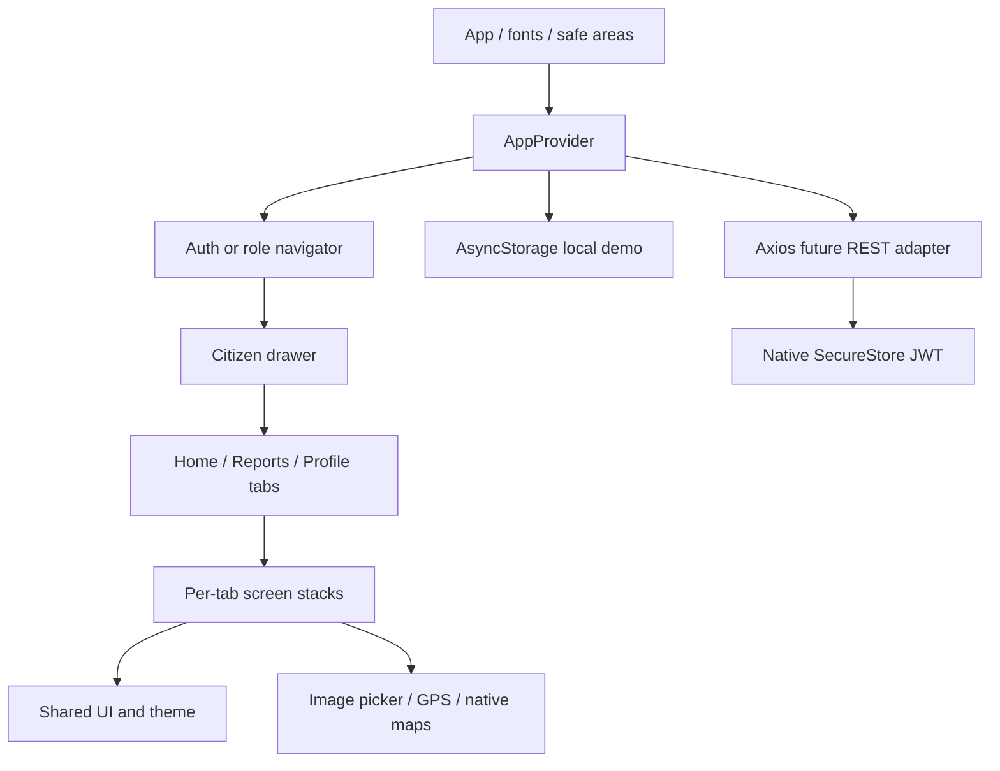

# Mobile architecture

Each tab owns its stack; the tab bar stays visible in child screens. Draft selections live in context across the reporting steps. Successful submission creates a report and clears the draft. Local persistence runs when profile, reports, or notifications change. Sign-out clears authentication and the draft but preserves demonstration data for the next session.

The app has no server secrets. Demo storage is unencrypted and intended for non-sensitive test data only. In API mode the server must enforce report ownership and status restrictions; client buttons are usability controls, not authorization.
